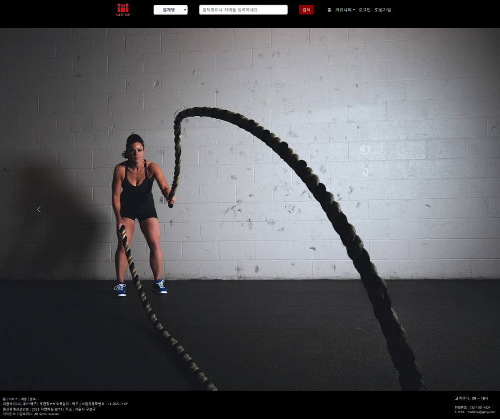
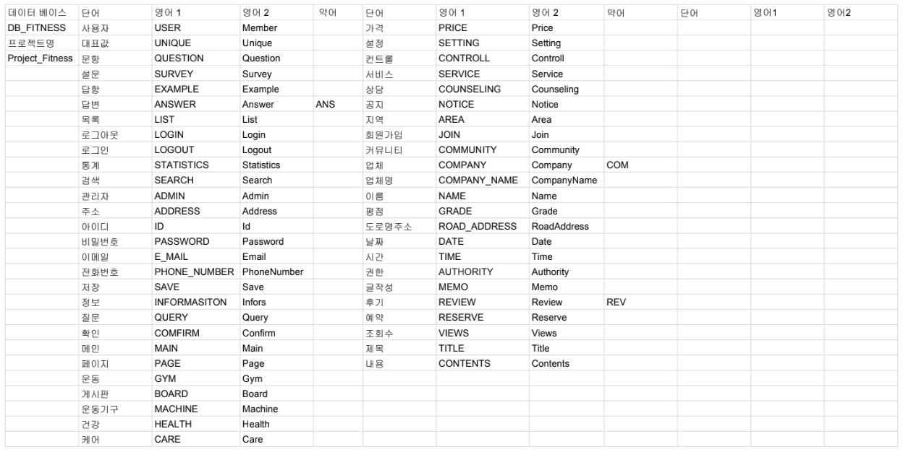

# [THE GLORY] 1차 프로젝트 (Project_Fitness)
### 프로젝트 기간 : 2023.07.07 - 2023.07.28
### 팀원 : 김민정, 김혜인, 봉원희, 임거산
### 사이트 : [ProjectFitness](https://goor.me/nsJpFt3xcvjGjWJE7)
### 
### 프로젝트 소개
이 프로젝트는 합리적인 가격 정보가 부족하고 헬스케어 시설의 리뷰를찾기 어렵고 상담 예약 기능이 있기 때문에  
   : 이 프로젝트는 무엇이고 왜 필요한지 간략하게 소개합니다.
   1. 합리적인 가격 정보 부재
   2. 헬스케어 시설의 리뷰를 찾기 어려움
   3. 상담 예약 기능의 미비
     이용자가 원하는 시설을 쉽고 빠르게 검색할 수 있도록 구성
### Stacks
* 사용언어 : HTML, CSS, JavaScript, Java
* 기술 : JSP, JQuery, Ajax
* 프레임워크 : SpringBoot, Spring Security, Bootstrap
* 개발툴 : Visual Studio Code
* DB: MySQL, MyBatis

# 프로젝트 진행
### 의뢰서 : [백구팀 의뢰서](https://drive.google.com/file/d/1lblekpdEg2pe1_rxwwxioMyzvDHQJ29q/view?usp=drive_link)
### 요구사항 정의서 : [백구팀 요구사항 정의서](https://docs.google.com/spreadsheets/d/1jdIUc4vH_-bnxaLaqOzVPo4ezpznmvHz/edit?usp=sharing&ouid=109657498147653913589&rtpof=true&sd=true)

### [NamingRule](src/main/resources/static/Image/README/네이밍룰.png) 
### [DB구성](DOCS/database/Fitness/main.png) : 
### 팀원별 구현 기능
**김민정**
|프론트엔드|백엔드|
|----------|-------|
|(**로그인**) 로그아웃/후기작성/회원정보수정/상담예약/회원정보 (**관리자**) 게시판관리/회원정보관리/공지사항관리/메인화면/로그인/로그아웃|(**비로그인**) 메인화면 (**관리자**) 게시판관리/공지사항관리|

**김혜인**
|프론트엔드|백엔드|
|----------|-------|
|(**비로그인**) 메인화면/회원가입/로그인/게시판/검색화면 (**로그인**) 메인화면/게시판/게시물작성/후기화면/검색화면|(**비로그인**) 검색화면 (**로그인**) 후기화면/후기작성화면/회원정보수정/상담예약 (**관리자**) 예약관리|

**봉원희**
|프론트엔드|백엔드|
|----------|-------|
|(**관리자**) 관리자권한부여|(**비로그인**) 회원가입/로그인 (**로그인**) 메인화면/검색화면/로그아웃/회원정보/관리자권한부여|

**임거산**
|프론트엔드|백엔드|
|----------|-------|
||(**비로그인**) 게시판 (**로그인**) 메인화면/게시판/게시물작성|

### 화면 구성
### 주요 기능
### 주요 코드

### 구현 영상
[Youtube영상]()

### 구현할 기능   
* 메뉴 : 메뉴바 하단에 운동별 카테고리 추가 후 클릭 시 지역별로 검색 결과가 도출될 수 있게 구성할 예정

# 프로젝트 종료
* 느낀점
